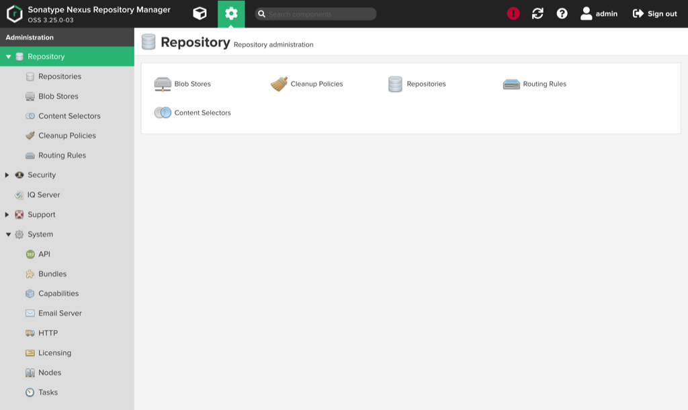

Copyright 2020-2021 Hewlett Packard Enterprise Development LP


Package Repository Management
=============================

* [Using Nexus](#using-nexus)
    * [Web UI over CAN](#web-ui-over-can)
    * [REST API](#rest-api)
        * [Pagination](#pagination)
        * [Check Status](#check-status)
        * [List Repositories](#list-repositories)
        * [List Assets](#list-assets)
        * [Create Repository](#create-repository)
        * [Update Repository](#update-repository)
        * [Delete Repository](#delete-repository)
        * [Create Blob Store](#create-blob-store)
        * [Delete Blob Store](#delete-repository)
        * [Upload Asset](#upload-asset)
    * [RPM Repositories](#rpm-repositories)
    * [Container Registry](#container-registry)
* [Nexus Configuration](#nexus-configuration)
    * [Blob Stores](#blob-stores)
    * [Repositories](#repositories)
* [Nexus Deployment](#nexus-deployment)
    * [Customizations](#customizations)
      * [Typical Deployment](#typical-deployment)
    * [Bootstrap Registry](#bootstrap-registry)
    * [Product Installers](#product-installers)
* [Post-Install Actions](#post-install-actions)
    * [Restrict Admin Privileges](#restrict-admin-privileges)
* [Maintenance](#maintenance)
    * [Repair Yum Repository Metadata](#repair-yum-repository-metadata)


<a name="using-nexus"></a>
## Using Nexus


<a name="web-ui-over-can"></a>
### Web UI over CAN

Use the hostname set in `istio.ingress.hosts.ui.authority` (see below), e.g.,
`https://nexus.{{network.dns.external}}/`, to connect to Nexus over the
CAN using a web browser. Users will be redirected to Keycloak to login and,
based on the default OPA policy, only _admin_ users should be authorized.
Scripts may connect by first obtaining a JWT token from Keycloak and passing
it in the HTTP `Authorization` header.


<a name="rest-api"></a>
### REST API

The [REST
API](https://help.sonatype.com/repomanager3/rest-and-integration-api) is
available from NCNs or compute nodes at `https://packages.local/service/rest`
as well as over the CAN at
`https://nexus.{{network.dns.external}}/service/rest` (requires JWT token in
the HTTP `Authorization` header).

Download the Open API document at `/service/rest/swagger.json` for details
about the API, including specific options to available endpoints. By default,
the REST API endpoints return (or accept) JSON.

The examples in the following sections use `curl` to exercise the REST API
endpoints and `jq` to parse and manipulate the output. It is reasonable to
use `curl` and `jq` to facilitate ad-hoc management tasks, but more complex
actions may warrant development of more full-featured tools.


<a name="pagination"></a>
#### Pagination

Be aware that various endpoints use
[pagination](https://help.sonatype.com/repomanager3/rest-and-integration-api/pagination)
to return results. When a `continuationToken` included in the results is
non-null it indicates additional items are available. For example, suppose
the output contains:

```json
{
  "items": [...],
  "continuationToken": "0a1b9d05d7162aa85d7747eaa75f171c"
}
```

Then the next set of results may be obtained by rerequesting the same URL
with the added query parameter
`continuationToken=0a1b9d05d7162aa85d7747eaa75f171c`. 

Various examples in the following sections may use the `paginate` helper
function to iterate over paginated results:

```bash
function paginate() {
    local url="$1"
    local token
    { token="$(curl -sSk "$url" | tee /dev/fd/3 | jq -r '.continuationToken // null')"; } 3>&1
    until [[ "$token" == "null" ]]; do
        { token="$(curl -sSk "$url&continuationToken=${token}" | tee /dev/fd/3 | jq -r '.continuationToken // null')"; } 3>&1
    done
}
```


<a name="check-status"></a>
#### Check Status

Send an HTTP `GET` to `/service/rest/v1/status` to check the operating status
of Nexus. An HTTP `200 OK` response indicates it is healthy:

```bash
ncn-m001:~ # curl -sSi https://packages.local/service/rest/v1/status
HTTP/2 200 
date: Sat, 06 Mar 2021 17:27:56 GMT
server: istio-envoy
x-content-type-options: nosniff
content-length: 0
x-envoy-upstream-service-time: 6

```

Also, before attempting to _write_ to Nexus it is recommended to check that
Nexus is _writable_ by sending an HTTP `GET` to
`/service/rest/v1/status/writable`:

```bash
ncn-m001:~ # curl -sSi https://packages.local/service/rest/v1/status/writable
HTTP/2 200 
date: Sat, 06 Mar 2021 17:28:34 GMT
server: istio-envoy
x-content-type-options: nosniff
content-length: 0
x-envoy-upstream-service-time: 6

```


<a name="list-repositories"></a>
#### List Repositories

> **`NOTE`** Niether the `v1` nor `beta` `repositories` endpoints discussed
> below are [paginated](#pagination).

Use `/service/rest/v1/repositories` to get a basic listing of available
repositories:

```bash
ncn-m001:~ # curl -sSk https://packages.local/service/rest/v1/repositories | jq -r '.[] | .name'
```

The `/service/rest/v1/repositories` endpoint provides a more detailed
listing of available repositories. For example, the object returned for the
`csm-sle-15sp2` repository is:

```bash
ncn-m001:~ # curl -sSk https://packages.local/service/rest/v1/repositories | jq -r '.[] | select(.name == "csm-sle-15sp2")'
{
  "name": "csm-sle-15sp2",
  "format": "raw",
  "url": "https://packages.local/repository/csm-sle-15sp2",
  "online": true,
  "storage": {
    "blobStoreName": "csm",
    "strictContentTypeValidation": false
  },
  "group": {
    "memberNames": [
      "csm-0.8.0-sle-15sp2"
    ]
  },
  "type": "group"
}
```


<a name="list-assets"></a>
#### List Assets

> **`CAUTION`** The `/service/rest/v1/components` endpoint is
> [paginated](#pagination).

Use the `/service/rest/v1/comonents` to list the assets in a specific
repository `<repo>`:

```bash
ncn-m001:~ # paginate 'https://packages.local/service/rest/v1/components?repository=<repo>' | jq -r '.items[] | .name'
```

For example, to list the names of all components in the `csm-sle-15sp2`
repository:

```bash
ncn-m001:~ # paginate "https://packages.local/service/rest/v1/components?repository=csm-sle-15sp2" | jq -r  '.items[] | .name' | sort -u
noarch/basecamp-1.0.1-20210126131805_a665272.noarch.rpm
noarch/csm-testing-1.3.2-20210205160852_e012960.noarch.rpm
noarch/docs-csm-install-1.7.4-20210206165423_2fae6fa.noarch.rpm
noarch/dracut-metal-dmk8s-1.4.7-20210129115153_7a86571.noarch.rpm
noarch/dracut-metal-luksetcd-1.0.2-20210129115153_b34f9a5.noarch.rpm
noarch/dracut-metal-mdsquash-1.4.20-20210201222655_e20e2ee.noarch.rpm
noarch/goss-servers-1.3.2-20210205160852_e012960.noarch.rpm
noarch/hpe-csm-goss-package-0.3.13-20210127124704_aae8d77.noarch.rpm
noarch/hpe-csm-scripts-0.0.4-20210125173103_a527e49.noarch.rpm
noarch/hpe-csm-yq-package-3.4.1-20210127134802_789be45.noarch.rpm
noarch/metal-ipxe-1.4.33-20210127152038_ef91cc8.noarch.rpm
noarch/metal-net-scripts-0.0.1-20210204114016_95ab47a.noarch.rpm
noarch/nexus-0.5.2-1.20210115090713_aef3950.noarch.rpm
noarch/platform-utils-0.1.2-20210115162116_1139af5.noarch.rpm
noarch/platform-utils-0.1.5-20210203170424_ca869e9.noarch.rpm
repodata/2aadc798a4f7e12e99be79e0faa8bb2c2fe05871295edda8a4045fd371e7a568-primary.xml.gz
repodata/452f91a378fa64c52534c984b90cf492e546334732c5b940b8fe5cfe2aebde29-filelists.sqlite.bz2
repodata/8dbbe7d1fceb13ccbae981aa9abe8575004df7bb3c0a74669502b5ea53a5455c-other.xml.gz
repodata/a4e95cc8a79f42b150d6c505c3f8e6bf242ee69de7849a2973dd19e0c1d8f07a-filelists.xml.gz
repodata/d3a16a9bceebf92fd640d689a8c015984d2963e4c11d7a841ec9b24cc135e99a-primary.sqlite.bz2
repodata/e9e8163a7c956f38eb37d6af3f1ac1bdae8079035843c9cd22ced9e824498da0-other.sqlite.bz2
repodata/repomd.xml
x86_64/cfs-state-reporter-1.4.4-20201204120230_c198848.x86_64.rpm
x86_64/cfs-state-reporter-1.4.6-20210128142236_6bb340b.x86_64.rpm
x86_64/cfs-trust-1.0.2-20201216135115_58f3d86.x86_64.rpm
x86_64/cfs-trust-1.0.3-20210125135157_2a234cb.x86_64.rpm
x86_64/craycli-0.40.8-20210122153602_8689250.x86_64.rpm
x86_64/craycli-wrapper-0.40.6-20210122144319_0608411.x86_64.rpm
x86_64/cray-cmstools-crayctldeploy-0.8.18-20210129163615_eebc7e8.x86_64.rpm
x86_64/cray-metal-basecamp-1.1.0-20210203221641_1de4aa6.x86_64.rpm
x86_64/cray-nexus-0.9.0-2.20210204104035_080a74e.x86_64.rpm
x86_64/cray-site-init-1.5.18-20210204150234_b3ed304.x86_64.rpm
x86_64/cray-switchboard-1.2.0-20201204104325_4cadbeb.x86_64.rpm
x86_64/cray-uai-util-1.0.5-20201210081525_e7edeef.x86_64.rpm
x86_64/csm-ssh-keys-1.0.3-20201211133315_1c474e9.x86_64.rpm
x86_64/csm-ssh-keys-1.0.4-20210125120351_1193c0c.x86_64.rpm
x86_64/csm-ssh-keys-roles-1.0.3-20201211133315_1c474e9.x86_64.rpm
x86_64/csm-ssh-keys-roles-1.0.4-20210125120351_1193c0c.x86_64.rpm
x86_64/hms-ct-test-crayctldeploy-1.3.2-20210203105451_5db2610.x86_64.rpm
x86_64/loftsman-1.0.3.3-20210111191208_5322725.x86_64.rpm
x86_64/manifestgen-1.3.1-20210201191257_7a2f66d.x86_64.rpm
```

Each component item has the following structure:

```json
{
  "id": "Y3NtLXNsZS0xNXNwMjowYTFiOWQwNWQ3MTYyYWE4NWQ3NzQ3ZWFhNzVmMTcxYw",
  "repository": "csm-sle-15sp2",
  "format": "raw",
  "group": "/noarch",
  "name": "noarch/csm-testing-1.3.2-20210205160852_e012960.noarch.rpm",
  "version": null,
  "assets": [
    {
      "downloadUrl": "https://packages.local/repository/csm-sle-15sp2/noarch/csm-testing-1.3.2-20210205160852_e012960.noarch.rpm",
      "path": "noarch/csm-testing-1.3.2-20210205160852_e012960.noarch.rpm",
      "id": "Y3NtLXNsZS0xNXNwMjpiZDdmNzllMTk2NzMwNTA4NjQ1OTczNzQwYTMwZTRjMg",
      "repository": "csm-sle-15sp2",
      "format": "raw",
      "checksum": {
        "sha1": "daecc7f20e1ddd5dd50b8b40351203882e2ad1c4",
        "sha512": "5343a189a7fb10bd43033f6b36e13cb85d75e705de2fab63a18c7cda4e3e57233ee3bfe55450e497aa0fbbdf2f2d024fb2ef2c3081e529a0bde9fa843d06a288",
        "sha256": "f7f779126031bcbc266c81d5f1546852aee0fb08890b7fba07b6fafd23e79d3b",
        "md5": "2a600edec22b34cbf5886db725389ed0"
      }
    }
  ]
}
```

For example, to list the download URLs for each asset in the `csm-sle-15sp2`
repository:

```bash
ncn-m001:~ # paginate "https://packages.local/service/rest/v1/components?repository=csm-sle-15sp2" | jq -r  '.items[] | .assets[] | .downloadUrl' | sort -u
https://packages.local/repository/csm-sle-15sp2/noarch/basecamp-1.0.1-20210126131805_a665272.noarch.rpm
https://packages.local/repository/csm-sle-15sp2/noarch/csm-testing-1.3.2-20210205160852_e012960.noarch.rpm
https://packages.local/repository/csm-sle-15sp2/noarch/docs-csm-install-1.7.4-20210206165423_2fae6fa.noarch.rpm
https://packages.local/repository/csm-sle-15sp2/noarch/dracut-metal-dmk8s-1.4.7-20210129115153_7a86571.noarch.rpm
https://packages.local/repository/csm-sle-15sp2/noarch/dracut-metal-luksetcd-1.0.2-20210129115153_b34f9a5.noarch.rpm
https://packages.local/repository/csm-sle-15sp2/noarch/dracut-metal-mdsquash-1.4.20-20210201222655_e20e2ee.noarch.rpm
https://packages.local/repository/csm-sle-15sp2/noarch/goss-servers-1.3.2-20210205160852_e012960.noarch.rpm
https://packages.local/repository/csm-sle-15sp2/noarch/hpe-csm-goss-package-0.3.13-20210127124704_aae8d77.noarch.rpm
https://packages.local/repository/csm-sle-15sp2/noarch/hpe-csm-scripts-0.0.4-20210125173103_a527e49.noarch.rpm
https://packages.local/repository/csm-sle-15sp2/noarch/hpe-csm-yq-package-3.4.1-20210127134802_789be45.noarch.rpm
https://packages.local/repository/csm-sle-15sp2/noarch/metal-ipxe-1.4.33-20210127152038_ef91cc8.noarch.rpm
https://packages.local/repository/csm-sle-15sp2/noarch/metal-net-scripts-0.0.1-20210204114016_95ab47a.noarch.rpm
https://packages.local/repository/csm-sle-15sp2/noarch/nexus-0.5.2-1.20210115090713_aef3950.noarch.rpm
https://packages.local/repository/csm-sle-15sp2/noarch/platform-utils-0.1.2-20210115162116_1139af5.noarch.rpm
https://packages.local/repository/csm-sle-15sp2/noarch/platform-utils-0.1.5-20210203170424_ca869e9.noarch.rpm
https://packages.local/repository/csm-sle-15sp2/repodata/2aadc798a4f7e12e99be79e0faa8bb2c2fe05871295edda8a4045fd371e7a568-primary.xml.gz
https://packages.local/repository/csm-sle-15sp2/repodata/452f91a378fa64c52534c984b90cf492e546334732c5b940b8fe5cfe2aebde29-filelists.sqlite.bz2
https://packages.local/repository/csm-sle-15sp2/repodata/8dbbe7d1fceb13ccbae981aa9abe8575004df7bb3c0a74669502b5ea53a5455c-other.xml.gz
https://packages.local/repository/csm-sle-15sp2/repodata/a4e95cc8a79f42b150d6c505c3f8e6bf242ee69de7849a2973dd19e0c1d8f07a-filelists.xml.gz
https://packages.local/repository/csm-sle-15sp2/repodata/d3a16a9bceebf92fd640d689a8c015984d2963e4c11d7a841ec9b24cc135e99a-primary.sqlite.bz2
https://packages.local/repository/csm-sle-15sp2/repodata/e9e8163a7c956f38eb37d6af3f1ac1bdae8079035843c9cd22ced9e824498da0-other.sqlite.bz2
https://packages.local/repository/csm-sle-15sp2/repodata/repomd.xml
https://packages.local/repository/csm-sle-15sp2/x86_64/cfs-state-reporter-1.4.4-20201204120230_c198848.x86_64.rpm
https://packages.local/repository/csm-sle-15sp2/x86_64/cfs-state-reporter-1.4.6-20210128142236_6bb340b.x86_64.rpm
https://packages.local/repository/csm-sle-15sp2/x86_64/cfs-trust-1.0.2-20201216135115_58f3d86.x86_64.rpm
https://packages.local/repository/csm-sle-15sp2/x86_64/cfs-trust-1.0.3-20210125135157_2a234cb.x86_64.rpm
https://packages.local/repository/csm-sle-15sp2/x86_64/craycli-0.40.8-20210122153602_8689250.x86_64.rpm
https://packages.local/repository/csm-sle-15sp2/x86_64/craycli-wrapper-0.40.6-20210122144319_0608411.x86_64.rpm
https://packages.local/repository/csm-sle-15sp2/x86_64/cray-cmstools-crayctldeploy-0.8.18-20210129163615_eebc7e8.x86_64.rpm
https://packages.local/repository/csm-sle-15sp2/x86_64/cray-metal-basecamp-1.1.0-20210203221641_1de4aa6.x86_64.rpm
https://packages.local/repository/csm-sle-15sp2/x86_64/cray-nexus-0.9.0-2.20210204104035_080a74e.x86_64.rpm
https://packages.local/repository/csm-sle-15sp2/x86_64/cray-site-init-1.5.18-20210204150234_b3ed304.x86_64.rpm
https://packages.local/repository/csm-sle-15sp2/x86_64/cray-switchboard-1.2.0-20201204104325_4cadbeb.x86_64.rpm
https://packages.local/repository/csm-sle-15sp2/x86_64/cray-uai-util-1.0.5-20201210081525_e7edeef.x86_64.rpm
https://packages.local/repository/csm-sle-15sp2/x86_64/csm-ssh-keys-1.0.3-20201211133315_1c474e9.x86_64.rpm
https://packages.local/repository/csm-sle-15sp2/x86_64/csm-ssh-keys-1.0.4-20210125120351_1193c0c.x86_64.rpm
https://packages.local/repository/csm-sle-15sp2/x86_64/csm-ssh-keys-roles-1.0.3-20201211133315_1c474e9.x86_64.rpm
https://packages.local/repository/csm-sle-15sp2/x86_64/csm-ssh-keys-roles-1.0.4-20210125120351_1193c0c.x86_64.rpm
https://packages.local/repository/csm-sle-15sp2/x86_64/hms-ct-test-crayctldeploy-1.3.2-20210203105451_5db2610.x86_64.rpm
https://packages.local/repository/csm-sle-15sp2/x86_64/loftsman-1.0.3.3-20210111191208_5322725.x86_64.rpm
https://packages.local/repository/csm-sle-15sp2/x86_64/manifestgen-1.3.1-20210201191257_7a2f66d.x86_64.rpm
```


<a name="create-repository"></a>
#### Create Repository

A repository may be created by HTTP `POST` to
`/service/rest/v1/repositories/<format>/<type>` with an appropriate body
that defines the repository settings. For example, to create a `hosted` `yum`
repository for RPMs using the `default` blob store, HTTP `POST` the following
body (replace `<name>` as appropriate) to
`/service/rest/v1/repositories/yum/hosted`:

```json
{
  "name": "<name>",
  "online": true,
  "storage": {
    "blobStoreName": "default",
    "strictContentTypeValidation": true,
    "writePolicy": "ALLOW_ONCE"
  },
  "cleanup": null,
  "yum": {
    "repodataDepth": 0,
    "deployPolicy": "STRICT"
  },
  "format": "yum",
  "type": "hosted"
}
```

Note the `storage` and `yum` options to control repository behavior.

Whereas to create a `proxy` repository to an upstream repository given by
`<url>`, HTTP `POST` the following body (replace `<name>` and `<url>` as
appropriate) to `/service/rest/v1/repositories/raw/proxy`:

```json
{
  "cleanup": null,
  "format": "raw",
  "httpClient": {
    "authentication": null,
    "autoBlock": false,
    "blocked": false,
    "connection": null
  },
  "name": "<name>",
  "negativeCache": {
    "enabled": false,
    "timeToLive": 0
  },
  "online": true,
  "proxy": {
    "contentMaxAge": 1440,
    "metadataMaxAge": 5,
    "remoteUrl": "<url>"
  },
  "routingRule": null,
  "storage": {
    "blobStoreName": "default",
    "strictContentTypeValidation": false
  },
  "type": "proxy"
}
```

Note the `proxy`, `httpClient`, and `negativeCache` options that affect proxy
behavior. It may be helpful to create a repository via the Web UI then
retrieve it's configuration via the `/service/rest/v1/repositories`
endpoint (see below) in order to discover how to set appropriate settings.

Installers typically define Nexus repositories in `nexus-repositories.yaml`
and rely on the `nexus-repositories-create` helper script included in the
`cray/cray-nexus-setup` container image to facilitate creation.


<a name="update-repository"></a>
#### Update Repository

Repository configration may be updated sending HTTP `PUT` to
`/service/rest/v1/repositories/<format>/<type>/<name>`. For example suppose
the `yum` `hosted` repository `test` is currently online and we want to
ensure it is offline instead. Send an HTTP `PUT` to
`/service/rest/v1/repositories/yum/hosted/test` after getting the current
configuration and setting the `online` attribute to `true`:

```bash
ncn-m001:~ # curl -sS https://packages.local/service/rest/v1/repositories | jq '.[] | select(.name == "test")'
{
  "name": "test",
  "url": "https://packages.local/repository/test",
  "online": true,
  "storage": {
    "blobStoreName": "default",
    "strictContentTypeValidation": true,
    "writePolicy": "ALLOW_ONCE"
  },
  "cleanup": null,
  "yum": {
    "repodataDepth": 0,
    "deployPolicy": "STRICT"
  },
  "format": "yum",
  "type": "hosted"
}
ncn-m001:~ # curl -sS https://packages.local/service/rest/v1/repositories | jq '.[] | select(.name == "test") | .online = false' | curl -sSi -X PUT 'https://packages.local/service/rest/v1/repositories/yum/hosted/test' -H "Content-Type: application/json" -d @-
HTTP/2 204 
date: Sat, 06 Mar 2021 17:55:57 GMT
server: istio-envoy
x-content-type-options: nosniff
x-envoy-upstream-service-time: 9

ncn-m001:~ # curl -sS https://packages.local/service/rest/v1/repositories | jq '.[] | select(.name == "test")'
{
  "name": "test",
  "url": "https://packages.local/repository/test",
  "online": false,
  "storage": {
    "blobStoreName": "default",
    "strictContentTypeValidation": true,
    "writePolicy": "ALLOW_ONCE"
  },
  "cleanup": null,
  "yum": {
    "repodataDepth": 0,
    "deployPolicy": "STRICT"
  },
  "format": "yum",
  "type": "hosted"
}
```


<a name="delete-repository"></a>
#### Delete Repository

To delete a repository, send an HTTP `DELETE` to
`/service/rest/v1/repositories/<name>`. For example,

```bash
# curl -sfkSL -X DELETE "https://packages.local/service/rest/v1/repositories/<name>”
```


<a name="create-blob-store"></a>
#### Create Blob Store

A `File` type blob store may be created by HTTP `POST` to
`/service/rest/v1/blobstores/file` with the following body (replace
`<name>` as appropriate):

```json
{
    "name": "<name>",
    "path": "/nexus-data/blobs/<name>",
    "softQuota": null
}
```

Installers typically define Nexus blob stores in `nexus-blobstores.yaml` and
rely on the `nexus-blobstores-create` helper script included in the
`cray/cray-nexus-setup` container image to facilitate creation.


<a name="delete-blob-store"></a>
#### Delete Blob Store

To delete a blob store, send an HTTP `DELETE` to
`/service/rest/v1/blobstores/<name>`. For example,

```bash
# curl -sfkSL -X DELETE "https://packages.local/service/rest/v1/blobstores/<name>"
```


<a name="rpm-repositories">
### RPM Repositories

Repositories are available at `https://packages.local/repository/<name>`. For
example, to configure the `csm-sle-15sp2` repository on an NCN:

> **`NOTE`** The `-G` option is used in the following example to disable GPG
> checks; however, if the named repository is properly signed, it is not
> recommended to use `-G`.

```bash
ncn-m001:~ # zypper addrepo -fG https://packages.local/repository/csm-sle-15sp2 csm-sle-15sp2
Adding repository 'csm-sle-15sp2' .................................................................................................[done]
Warning: GPG checking is disabled in configuration of repository 'csm-sle-15sp2'. Integrity and origin of packages cannot be verified.
Repository 'csm-sle-15sp2' successfully added

URI         : https://packages.local/repository/csm-sle-15sp2
Enabled     : Yes
GPG Check   : No
Autorefresh : Yes
Priority    : 99 (default priority)

Repository priorities are without effect. All enabled repositories share the same priority.
ncn-m001:~ # zypper ref csm-sle-15sp2
Retrieving repository 'csm-sle-15sp2' metadata ....................................................................................[done]
Building repository 'csm-sle-15sp2' cache .........................................................................................[done]
Specified repositories have been refreshed.
```


<a name="container-registry"></a>
### Container Registry

The container registry is available at `https://registry.local` on the NCNs
or compute nodes.

> **`NOTE`** By default access to the container registry is not available
> over CAN. If desired, a corresponding route may be added to the `nexus`
> VirtualService resource in the `nexus` namespace:
> 
> ```bash
> ncn-m001:~ # kubectl -n nexus get vs nexus
> NAME    GATEWAYS                      HOSTS                                                     AGE
> nexus   [services/services-gateway]   [packages.local registry.local nexus.odin.dev.cray.com]   21d
> ```

> **`CAUTION`** If access to the container registry in Nexus is exposed over
> CAN, it is strongly recommended to setup and configure fine-grained access
> control; however, as mentioned abovem, the default setup assumes the OPA
> policy only permits _admin_ users access.

The only way to add images to the container registry is via the Docker API,
i.e., by using a client (e.g., Skopeo, Podman, Docker) to push images. By
default, product installers use Podman with a vendored version of the
[Skopeo](https://github.com/containers/skopeo) image to sync container images
included in a release distribution to `registry.local`. Also, CSM adds a
recent version of `quay.io/skopeo/stable` to the container registry, and it
may be used to copy images into `registry.local`. For example, to update the
version of `quay.io/skopeo/stable`:

```bash
ncn-m001:~ # podman run --rm registry.local/skopeo/stable copy --dest-tls-verify=false docker://quay.io/skopeo/stable docker://registry.local/skopeo/stable
Getting image source signatures
Copying blob sha256:85a74b04b5b84b45c763e9763cc0f62269390bb30058d3e2b2545d820d3558f7
Copying blob sha256:ab9d1e8c4764f52ed5041c38bd3d64b6ae9c27d0f436be50f658ece38440a97b
Copying blob sha256:e5c8e56645c4d70308640ede3f72f76386b466cf5d97010b9c2f31054caf30a5
Copying blob sha256:bcf471c5e964dc3ce3e7249bd2b1493acf3dd103a28af0cfe5af70351ad399d0
Copying blob sha256:d62975d5ffa72581b912ee3e1a850e2ac14435a4238253a8ebf80f5d10f2df4c
Copying blob sha256:8c87d899c1ab2cc2d25708ba0ff9a1726fe6b57bf415c8fdc7de973e6b185f63
Copying config sha256:49f2b6d9790b48aadb2ac29f5bfef56ebb2fccec6319b3981639d04452887848
Writing manifest to image destination
Storing signatures
```

Kubernetes Pods are expected to rely on the registry mirror configuration in
`/etc/containerd/config.toml` to automatically fetch container images from it
using upstream references. By default, the following upstream registries are
automatically redirected to `registry.local`:

* `dtr.dev.cray.com`
* `docker.io` (and `registry-1.docker.io`)
* `quay.io`
* `gcr.io`
* `k8s.gcr.io`

> **`CAUTION`** The registry mirror configuration in
> `/etc/containerd/config.toml` only applies to the CRI. When using the `ctr`
> command or another container runtime (e.g., `podman`, `docker`) you'll need
> to explicitly reference `registry.local`. For example to pull
> `dtr.dev.cray.com/baseos/alpine:3.12.0` using CRI:

```bash
ncn-m001:~ # crictl pull dtr.dev.cray.com/baseos/alpine:3.12.0
Image is up to date for sha256:5779738096ecb47dd7192d44ceef7032110edd38204f66c9ca4e35fca952975c
```

Whereas using containerd or Podman tooling requires changing
`dtr.dev.cray.com` to `registry.local` to guarantee the runtime fetches the
image from the container registry in Nexus:

```bash
ncn-m001:~ # ctr image pull registry.local/baseos/alpine:3.12.0
registry.local/baseos/alpine:3.12.0:                                              resolved       |++++++++++++++++++++++++++++++++++++++| 
manifest-sha256:e25f4e287fad9c0ee0a47af590e999f9ff1f043fb636a9dc7a61af6d13fc40ca: done           |++++++++++++++++++++++++++++++++++++++| 
layer-sha256:3ab6766f6281be4c2349e2122bab3b4d1ba1b524236b85fce0784453e759b516:    done           |++++++++++++++++++++++++++++++++++++++| 
layer-sha256:df20fa9351a15782c64e6dddb2d4a6f50bf6d3688060a34c4014b0d9a752eb4c:    done           |++++++++++++++++++++++++++++++++++++++| 
layer-sha256:62694d7552ccd2338f8a4d775bef09ea56f6d2bcfdfafb9e2a4e0241f360fca5:    done           |++++++++++++++++++++++++++++++++++++++| 
config-sha256:5779738096ecb47dd7192d44ceef7032110edd38204f66c9ca4e35fca952975c:   done           |++++++++++++++++++++++++++++++++++++++| 
elapsed: 0.2 s                                                                    total:   0.0 B (0.0 B/s)                                         
unpacking linux/amd64 sha256:e25f4e287fad9c0ee0a47af590e999f9ff1f043fb636a9dc7a61af6d13fc40ca...
done
```

```bash
ncn-m001:~ # podman pull registry.local/baseos/alpine:3.12.0
Trying to pull registry.local/baseos/alpine:3.12.0...
Getting image source signatures
Copying blob df20fa9351a1 [--------------------------------------] 0.0b / 0.0b
Copying blob 3ab6766f6281 [--------------------------------------] 0.0b / 0.0b
Copying blob 62694d7552cc [--------------------------------------] 0.0b / 0.0b
Copying config 5779738096 done  
Writing manifest to image destination
Storing signatures
5779738096ecb47dd7192d44ceef7032110edd38204f66c9ca4e35fca952975c
```


<a name="nexus-configuration"></a>
Nexus Configuration
-------------------

<a name="blob-stores"></a>
### Blob Stores

In general, expect each product to create and use its own `File` type blob
store. For example, CSM uses `csm`.

The `default` blob store is also available, but Cray products are discouraged
from using it.


<a name="repositories"></a>
### Repositories

CSM creates the `registry` (format `docker`) and `charts` (format `helm`)
repositories for managing container images and Helm charts across all Cray
products. However, each product's release may contain a number of RPM
repositories that are added to Nexus. In order to support signed repository
metadata, in order to enable client GPG checks, RPM repositories are created
in Nexus as format `raw` repositories.


<a name="naming-conventions"></a>
#### Naming Conventions

RPM repositories should be named `<product>[-<product-version>]-<os-dist>-<os-version>[-compute][-<arch>]` where

* `<product>` indicates the product (e.g, ‘cos’, ‘csm’, ‘sma’)

* `-<product-version>` indicates the product version (e.g., `-1.4.0`,
  `-latest`, `-stable`)

    * Type `hosted` repositories must specify `-<product-version>` relative to
      the patch release.
    
    * Type `group` or `proxy` repositories whose sole member is a `hosted`
      repository (i.e., it serves as an alias) may use a more generic version
      (e.g., `-1.4`) or omit
      `-<product-version>` altogether if it represents the currently _active_
      version.

* `-<os-dist>` indicates the OS distribution (e.g., `-sle`)

* `-<os-version>` indicates the OS version (e.g., `-15sp1`, `-15sp2`)

* `-compute` must be specified if the repository contains RPMs specific to
  compute nodes and omitted otherwise; there is no suffix for repositories
  containing NCN RPMs

* `-<arch>` must be specified if the repository contains RPMs specific to a
  system architecture other than `x86_64` (e.g., `-aarch64`)


<a name="nexus-deployment"></a>
Nexus Deployment
----------------

Nexus is deployed via the `cray-nexus` chart to the `nexus` namespace as part
of the CSM release, after critical platform services are up and running.
Product installers configure and populate Nexus blob stores and repositories
using the vendored `cray-nexus-setup` container image. As a result, there is
no singular product that provides **all** Nexus repositories or assets;
instead, individual products must be installed. However, CSM configures the
`charts` Helm repository and the `registry` Docker repository which all
products may use.


<a name="customizations"></a>
### Customizations

For a complete set of available settings, consult the `values.yaml` file of
the `cray-nexus` chart. The most common customizations a customer may want to
set are specified in the chart below. They must be set in
`customizations.yaml` under `spec.kubernetes.services.cray-nexus`.

| Customization                            | Default                            | Description |
|------------------------------------------|------------------------------------|-------------|
| `istio.ingress.hosts.ui.enabled`         | `true`                             | Enables ingress from the CAN (default chart value is `false`) |
| `istio.ingress.hosts.ui.authority`       | `nexus.{{ network.dns.external }}` | Sets the CAN hostname (default chart value is `nexus.local`) |
| `sonatype-nexus.persistence.storageSize` | `1000Gi`                           | Nexus storage size, may be increased after installation; critical if `spec.kubernetes.services.cray-nexus-setup.s3.enabled` is `false` | 


<a name="typical-deployment"></a>
### Typical Deployment

A typical deployment will look similar to the following:

```
ncn-m001:~ # kubectl -n nexus get all
NAME                             READY   STATUS    RESTARTS   AGE
pod/cray-precache-images-6tp2c   2/2     Running   0          20d
pod/cray-precache-images-dnwdx   2/2     Running   0          20d
pod/cray-precache-images-jgvx8   2/2     Running   0          20d
pod/cray-precache-images-n2clw   2/2     Running   0          20d
pod/cray-precache-images-v8ntg   2/2     Running   0          17d
pod/cray-precache-images-xmg6d   2/2     Running   0          20d
pod/nexus-55d8c77547-xcc2f       2/2     Running   0          19d

NAME            TYPE        CLUSTER-IP     EXTERNAL-IP   PORT(S)           AGE
service/nexus   ClusterIP   10.23.120.95   <none>        80/TCP,5003/TCP   19d

NAME                                  DESIRED   CURRENT   READY   UP-TO-DATE   AVAILABLE   NODE SELECTOR   AGE
daemonset.apps/cray-precache-images   6         6         6       6            6           <none>          20d

NAME                    READY   UP-TO-DATE   AVAILABLE   AGE
deployment.apps/nexus   1/1     1            1           19d

NAME                               DESIRED   CURRENT   READY   AGE
replicaset.apps/nexus-55d8c77547   1         1         1       19dd
```

Note: The `cray-precache-images` DaemonSet is used to keep select container
images resident in the image cache on each worker node to ensure Nexus
resiliency. It is deployed as a critical platform component prior to Nexus.

> **`WARNING`** The `cray-nexus` chart deploys Nexus with a single replica
> and the corresponding `nexus-data` PVC with `RWX` access mode. Nexus should
> **NEVER** be scaled to more than one replica; otherwise, the instance data in
> `nexus-data`'s PV will most likely be corrupted. Using `RWX` access mode
> enables Nexus to quickly restart on another worker node in the event of a
> node failure and avoid additional delay due to volume multi-attach errors.


<a name="bootstrap-registry"></a>
### Bootstrap Registry

During installation, a Nexus instance is run on the pit node at port 8081 to
facilitate cluster bootstrap. It is only configured with a `docker` registry
available at `http://pit.nmn:5000`, which is populated with container images
included in the CSM release. By default, `http://pit.nmn:5000` is the default
mirror configured in `/etc/containerd/config.toml`; however, once the pit
node is rebooted as ncn-m001, then it will not be available.


<a name="product-installers"></a>
### Product installers

Product installers vendor the `dtr.dev.cray.com/cray/cray-nexus-setup:0.4.0`
container image that includes helper scripts for working with the Nexus REST
API to update and modify repostories, as shown above. By convention, product
release distributions will include `nexus-blobstores.yaml` and
`nexus-repositories.yaml` files which define the Nexus blob stores and
repositories required for that version of the product. Also, expect to find
directories that include specific types of assets:

- `rpm/` - RPM repositories
- `docker/` - Container images
- `helm/` - Helm Charts

Prior to deploying Helm charts to the system management Kubernetes cluster,
product installers will setup repositories in Nexus and then upload assets to
them. Typically, all this is automated in the beginning of a product's
`install.sh` script and looks something like the following:

```bash
ROOTDIR="$(dirname "${BASH_SOURCE[0]}")"
source "${ROOTDIR}/lib/version.sh"
source "${ROOTDIR}/lib/install.sh"

# Load vendored tools into install environment
load-install-deps

# Upload the contents of an RPM repository named $repo
nexus-upload raw "${ROOTDIR}/rpm/${repo}" "${RELEASE_NAME}-${RELEASE_VERSION}-${repo}"

# Setup Nexus
nexus-setup blobstores   "${ROOTDIR}/nexus-blobstores.yaml"
nexus-setup repositories "${ROOTDIR}/nexus-repositories.yaml"

# Upload container images to registry.local
skopeo-sync "${ROOTDIR}/docker"

# Upload charts to the "charts" repository
nexus-upload helm "${ROOTDIR}/helm" charts

# Remove vendored tools from install environment
clean-install-deps
```

Notice that product installers also load and clean up the install tools used
to facilitate installation. By convention, vendored tools will be in the
`vendor` directory. In case something goes wrong, it may be useful to
manually load them into the install environment to help with debugging.


<a name="post-install-actions"></a>
## Post-Install Actions

The following actions may be performed after completing system and product
installations.


<a name="restrict-admin-privileges"></a>
### Restrict Admin Privileges

By default, connections to packages.local and registry.local automatically
login clients as the `admin` user. This effectively enables _anonymous
writes_ to Nexus which means unauthenticated users can perform arbitrary
actions on Nexus itself (i.e., via the REST API) as well as Repositories
(e.g., upload or delete assets). Product installers currently do not expect
to authenticate to Nexus, so it is necessary to retain the default ingress
settings during installation. However, prior to making the system available
to users, it is **STRONGLY RECOMMENDED** that the ingress settings be
changed, to disable connections to packages.local and
registry.local from automatically gaining `admin` privileges.

1.  Ensure that the `registry` repository has `docker.forceBasicAuth` set to
    `true`:

    ```bash
    ncn-m001:~ # curl -sS https://packages.local/service/rest/v1/repositories | jq '.[] | select(.name == "registry") | .docker.forceBasicAuth = true' | curl -sSi -X PUT 'https://packages.local/service/rest/v1/repositories/docker/hosted/registry' -H "Content-Type: application/json" -d @-
    ```

2.  Patch the `nexus` VirtualService resource in the `nexus` namespace to
    remove the `X-WEBAUTH-USER` request header when the `authority` matches
    `packages.local` or `registry.local`:

    ```bash
    ncn-m001:~ # kubectl patch virtualservice -n nexus nexus --type merge --patch '{"spec":{"http":[{"match":[{"authority":{"exact":"packages.local"}}],"route":[{"destination":{"host":"nexus","port":{"number":80}},"headers":{"request":{"remove":["X-WEBAUTH-USER"]}}}]},{"match":[{"authority":{"exact":"registry.local"}}],"route":[{"destination":{"host":"nexus","port":{"number":5003}},"headers":{"request":{"remove":["X-WEBAUTH-USER"]}}}]},{"match":[{"authority":{"exact":"nexus.baldar.dev.cray.com"}}],"route":[{"destination":{"host":"nexus","port":{"number":80}},"headers":{"request":{"add":{"X-WEBAUTH-USER":"admin"},"remove":["Authorization"]}}}]}]}}'
    ```

    The above patch essentially changes:

    ```yaml
    spec:
      http:
      - match:
        - authority:
            exact: packages.local
        route:
        - destination:
            host: nexus
            port:
              number: 80
        headers:
          request:
            add:
              X-WEBAUTH-USER: admin
            remove:
            - Authorization
      - match:
        - authority:
            exact: registry.local
        route:
        - destination:
            host: nexus
            port:
              number: 5003
        headers:
          request:
            add:
              X-WEBAUTH-USER: admin
            remove:
            - Authorization
    ```

    into:

    ```yaml
    spec:
      http:
      - match:
        - authority:
            exact: packages.local
        route:
        - destination:
            host: nexus
            port:
              number: 80
        headers:
          request:
            remove:
            - X-WEBAUTH-USER
      - match:
        - authority:
            exact: registry.local
        route:
        - destination:
            host: nexus
            port:
              number: 5003
        headers:
          request:
            remove:
            - X-WEBAUTH-USER
    ```

    > **`NOTE`** To undo the above patch to e.g. support maintaenance
    > activities:
    >
    > ```bash
    > ncn-m001:~ # kubectl patch virtualservice -n nexus nexus --type merge --patch '{"spec":{"http":[{"match":[{"authority":{"exact":"packages.local"}}],"route":[{"destination":{"host":"nexus","port":{"number":80}},"headers":{"request":{"add":{"X-WEBAUTH-USER":"admin"},"remove":["Authorization"]}}}]},{"match":[{"authority":{"exact":"registry.local"}}],"route":[{"destination":{"host":"nexus","port":{"number":5003}},"headers":{"request":{"add":{"X-WEBAUTH-USER":"admin"},"remove":["Authorization"]}}}]},{"match":[{"authority":{"exact":"nexus.baldar.dev.cray.com"}}],"route":[{"destination":{"host":"nexus","port":{"number":80}},"headers":{"request":{"add":{"X-WEBAUTH-USER":"admin"},"remove":["Authorization"]}}}]}]}}'
    > ```


<a name="maintenance"></a>
## Maintenance


<a name="repair-yum-repository-metadata"></a>
### Repair Yum Repository Metadata

> **`NOTE`** In order to supported signed repository metadata, Cray products
> use format `raw` repositories instead of format `yum` repositories. However,
> the information in this section is retained for informational purposes.

Although [Nexus documentation on Yum
repositories](https://help.sonatype.com/repomanager3/formats/yum-repositories#YumRepositories-DeployingPackagestoYumHostedRepositories)
states that repairing Yum metadata is not typically required, Nexus may have
trouble (re)genertating repository metadata (e.g., `repodata/repomd.xml`),
espcially for larger repositories.

> The task Repair - Rebuild Yum repository metadata (repodata) can also be
> configured to create the metadata if the standard generation fails. This is
> not typically needed, thus is regarded as a Repair task.

See the [Nexus documentation on
Tasks](https://help.sonatype.com/repomanager3/system-configuration/tasks) for
more details, but the following screenshots show how to create a repair task to
rebuild Yum metadata for the `mirror-1.3.0-opensuse-leap-15` repository.





Warning: There is [a known issue where repair tasks for rebuilding Yum
repositories report being complete but are not actually
finished](https://issues.sonatype.org/browse/NEXUS-17263). Instead, there is a
`Finished rebuilding yum metadata for repository` log message that indicates it
is finshed, but additional errors may follow it indicating it wasn't succesful.

Even though the Nexus logs contains messages pertaining to tasks, it can be
difficult to track messages for a specific task, especially since rebuilding
Yum metadata takes a long time. In order to more easily track log messages
related to a specific task, `kubectl exec` into the running `nexus` pod and
`cat` the corresponding log file in `/nexus-data/log/tasks`. For example:

```
ncn-w001:~ # kubectl -n nexus get pods | grep nexus
nexus-55d8c77547-65k6q                           2/2     Running     1          22h
```

```
ncn-w001:~ # kubectl -n nexus exec -ti nexus-55d8c77547-65k6q -c nexus -- ls -ltr /nexus-data/log/tasks
total 8
-rw-r--r-- 1 nexus nexus 1763 Aug 23 00:50 repository.yum.rebuild.metadata-20200822235306934.log
-rw-r--r-- 1 nexus nexus 1525 Aug 23 01:00 repository.cleanup-20200823010000013.log
```

If multiple repositories are being rebuilt, search the logs for the specific
repository to find the latest corresponding log file. E.g., for
`mirror-1.3.0-opensuse-leap-15`:

```
ncn-w001:~ # kubectl -n nexus exec -ti nexus-55d8c77547-65k6q -c nexus -- grep -R 'Rebuilding yum metadata for repository mirror-1.3.0-opensuse-leap-15' /nexus-data/log/tasks
/nexus-data/log/tasks/repository.yum.rebuild.metadata-20200822235306934.log:2020-08-22 23:53:06,936+0000 INFO  [event-12-thread-797]  *SYSTEM org.sonatype.nexus.repository.yum.internal.createrepo.CreateRepoFacetImpl - Rebuilding yum metadata for repository mirror-1.3.0-opensuse-leap-15
```

The log file of a successful rebuild will look similar to this: 

```
ncn-w001:~ # kubectl -n nexus exec -ti nexus-55d8c77547-65k6q -c nexus -- cat /nexus-data/log/tasks/repository.yum.rebuild.metadata-20200822235306934.log
2020-08-22 23:53:06,934+0000 INFO  [quartz-9-thread-20]  *SYSTEM org.sonatype.nexus.repository.yum.internal.createrepo.task.YumCreateRepoTask - Task information:
2020-08-22 23:53:06,935+0000 INFO  [quartz-9-thread-20]  *SYSTEM org.sonatype.nexus.repository.yum.internal.createrepo.task.YumCreateRepoTask -  ID: 35536bcd-3947-4ba9-8d6d-43dcadbb87ad
2020-08-22 23:53:06,935+0000 INFO  [quartz-9-thread-20]  *SYSTEM org.sonatype.nexus.repository.yum.internal.createrepo.task.YumCreateRepoTask -  Type: repository.yum.rebuild.metadata
2020-08-22 23:53:06,935+0000 INFO  [quartz-9-thread-20]  *SYSTEM org.sonatype.nexus.repository.yum.internal.createrepo.task.YumCreateRepoTask -  Name: Rebuild Yum metadata - mirror-1.3.0-opensuse-leap-15
2020-08-22 23:53:06,935+0000 INFO  [quartz-9-thread-20]  *SYSTEM org.sonatype.nexus.repository.yum.internal.createrepo.task.YumCreateRepoTask -  Description: Rebuild metadata for mirror-1.3.0-opensuse-leap-15
2020-08-22 23:53:06,936+0000 INFO  [quartz-9-thread-20]  *SYSTEM org.sonatype.nexus.repository.yum.internal.createrepo.task.YumCreateRepoTask - Task log: /nexus-data/log/tasks/repository.yum.rebuild.metadata-20200822235306934.log
2020-08-22 23:53:06,936+0000 INFO  [event-12-thread-797]  *SYSTEM org.sonatype.nexus.repository.yum.internal.createrepo.CreateRepoFacetImpl - Rebuilding yum metadata for repository mirror-1.3.0-opensuse-leap-15
2020-08-22 23:53:06,936+0000 INFO  [quartz-9-thread-20]  *SYSTEM org.sonatype.nexus.repository.yum.internal.createrepo.task.YumCreateRepoTask - Task complete
2020-08-23 00:50:47,468+0000 INFO  [event-12-thread-797]  *SYSTEM org.sonatype.nexus.repository.yum.internal.createrepo.CreateRepoFacetImpl - Finished rebuilding yum metadata for repository mirror-1.3.0-opensuse-leap-15
```

Notice that the `Finished rebuilding yum metadata for repository` without any
other `ERROR` or `WARN` messages indicates the rebuild has completed
successfully.  In this case it took nearly **58 minutes** to finish! The time
it takes to run is related to the size of the repository, so expect the
`mirror-1.3.0-` repositories to take a while.


#### Rebuild failures

When a rebuild fails, expect to see `ERROR` and `WARN` messages around the same
time as the `Finished rebuilding yum metadata for repository` message. For
example, consider the log from a failed rebuild of
`mirror-1.3.0-opensuse-leap-15`:

```
ncn-w001:~ # kubectl -n nexus exec -ti nexus-55d8c77547-65k6q -c nexus -- cat /nexus-data/log/tasks/repository.yum.rebuild.metadata-20200822231259523.log
2020-08-22 23:12:59,523+0000 INFO  [quartz-9-thread-20]  *SYSTEM org.sonatype.nexus.repository.yum.internal.createrepo.task.YumCreateRepoTask - Task information:
2020-08-22 23:12:59,526+0000 INFO  [quartz-9-thread-20]  *SYSTEM org.sonatype.nexus.repository.yum.internal.createrepo.task.YumCreateRepoTask -  ID: 35536bcd-3947-4ba9-8d6d-43dcadbb87ad
2020-08-22 23:12:59,526+0000 INFO  [quartz-9-thread-20]  *SYSTEM org.sonatype.nexus.repository.yum.internal.createrepo.task.YumCreateRepoTask -  Type: repository.yum.rebuild.metadata
2020-08-22 23:12:59,526+0000 INFO  [quartz-9-thread-20]  *SYSTEM org.sonatype.nexus.repository.yum.internal.createrepo.task.YumCreateRepoTask -  Name: Rebuild Yum metadata - mirror-1.3.0-opensuse-leap-15
2020-08-22 23:12:59,527+0000 INFO  [quartz-9-thread-20]  *SYSTEM org.sonatype.nexus.repository.yum.internal.createrepo.task.YumCreateRepoTask -  Description: Rebuild metadata for mirror-1.3.0-opensuse-leap-15
2020-08-22 23:12:59,529+0000 INFO  [quartz-9-thread-20]  *SYSTEM org.sonatype.nexus.repository.yum.internal.createrepo.task.YumCreateRepoTask - Task log: /nexus-data/log/tasks/repository.yum.rebuild.metadata-20200822231259523.log
2020-08-22 23:12:59,529+0000 INFO  [event-12-thread-780]  *SYSTEM org.sonatype.nexus.repository.yum.internal.createrepo.CreateRepoFacetImpl - Rebuilding yum metadata for repository mirror-1.3.0-opensuse-leap-15
2020-08-22 23:12:59,531+0000 INFO  [quartz-9-thread-20]  *SYSTEM org.sonatype.nexus.repository.yum.internal.createrepo.task.YumCreateRepoTask - Task complete
2020-08-22 23:24:16,974+0000 INFO  [Thread-1948 <command>sql.select from asset where (component IS NOT NULL  AND attributes.yum.asset_kind = :p0) and (bucket=#59:1)</command>]  *SYSTEM com.orientechnologies.common.profiler.OProfilerStub - $ANSI{green {db=component}} [TIP] Query 'SELECT FROM asset WHERE (component IS NOT NULL AND attributes.yum.asset_kind = "RPM" ) AND (bucket = #59:1 )' returned a result set with more than 10000 records. Check if you really need all these records, or reduce the resultset by using a LIMIT to improve both performance and used RAM
2020-08-22 23:29:57,700+0000 INFO  [event-12-thread-780]  *SYSTEM org.sonatype.nexus.repository.yum.internal.createrepo.CreateRepoFacetImpl - Finished rebuilding yum metadata for repository mirror-1.3.0-opensuse-leap-15
2020-08-22 23:29:57,701+0000 ERROR [event-12-thread-780]  *SYSTEM com.google.common.eventbus.EventBus.nexus.async - Could not dispatch event org.sonatype.nexus.repository.yum.internal.createrepo.YumMetadataInvalidationEvent@75b487e7 to subscriber org.sonatype.nexus.repository.yum.internal.createrepo.CreateRepoFacetImpl$$EnhancerByGuice$$9db995@93053b8 method [public void org.sonatype.nexus.repository.yum.internal.createrepo.CreateRepoFacetImpl.on(org.sonatype.nexus.repository.yum.internal.createrepo.YumMetadataInvalidationEvent)]
org.sonatype.nexus.repository.InvalidContentException: Invalid RPM: external/noarch/redeclipse-data-1.5.6-lp151.2.5.noarch.rpm
    at org.sonatype.nexus.repository.yum.internal.rpm.YumRpmParser.parse(YumRpmParser.java:108)
    at org.sonatype.nexus.repository.yum.internal.rpm.YumRpmParser.parse(YumRpmParser.java:76)
    at org.sonatype.nexus.repository.yum.internal.createrepo.CreateRepoServiceImpl.writeAssetToMetadata(CreateRepoServiceImpl.java:651)
    at org.sonatype.nexus.repository.yum.internal.createrepo.CreateRepoServiceImpl.appendRpm(CreateRepoServiceImpl.java:511)
    at org.sonatype.nexus.repository.yum.internal.createrepo.CreateRepoServiceImpl.loopAllRpmsAndAppend(CreateRepoServiceImpl.java:499)
    at org.sonatype.nexus.repository.yum.internal.createrepo.CreateRepoServiceImpl.writeMetadata(CreateRepoServiceImpl.java:477)
    at org.sonatype.nexus.repository.yum.internal.createrepo.CreateRepoServiceImpl.convertDirectoriesToMetadata(CreateRepoServiceImpl.java:180)
    at org.sonatype.nexus.repository.yum.internal.createrepo.CreateRepoServiceImpl.buildMetadata(CreateRepoServiceImpl.java:150)
    at org.sonatype.nexus.repository.yum.internal.createrepo.CreateRepoServiceImpl.buildMetadata(CreateRepoServiceImpl.java:134)
    at org.sonatype.nexus.repository.yum.internal.createrepo.CreateRepoServiceImpl.buildMetadataWithoutCaching(CreateRepoServiceImpl.java:125)
    at org.sonatype.nexus.transaction.TransactionalWrapper.proceedWithTransaction(TransactionalWrapper.java:57)
    at org.sonatype.nexus.transaction.TransactionInterceptor.proceedWithTransaction(TransactionInterceptor.java:66)
    at org.sonatype.nexus.transaction.TransactionInterceptor.invoke(TransactionInterceptor.java:55)
    at org.sonatype.nexus.repository.yum.internal.createrepo.CreateRepoFacetImpl.buildMetadata(CreateRepoFacetImpl.java:196)
    at org.sonatype.nexus.repository.yum.internal.createrepo.CreateRepoFacetImpl.on(CreateRepoFacetImpl.java:178)
    at sun.reflect.GeneratedMethodAccessor125.invoke(Unknown Source)
    at sun.reflect.DelegatingMethodAccessorImpl.invoke(DelegatingMethodAccessorImpl.java:43)
    at java.lang.reflect.Method.invoke(Method.java:498)
    at com.google.common.eventbus.Subscriber.invokeSubscriberMethod(Subscriber.java:87)
    at com.google.common.eventbus.Subscriber$SynchronizedSubscriber.invokeSubscriberMethod(Subscriber.java:144)
    at com.google.common.eventbus.Subscriber$1.run(Subscriber.java:72)
    at org.sonatype.nexus.thread.internal.MDCAwareRunnable.run(MDCAwareRunnable.java:40)
    at org.apache.shiro.subject.support.SubjectRunnable.doRun(SubjectRunnable.java:120)
    at org.apache.shiro.subject.support.SubjectRunnable.run(SubjectRunnable.java:108)
    at java.util.concurrent.ThreadPoolExecutor.runWorker(ThreadPoolExecutor.java:1149)
    at java.util.concurrent.ThreadPoolExecutor$Worker.run(ThreadPoolExecutor.java:624)
    at java.lang.Thread.run(Thread.java:748)
Caused by: java.net.SocketTimeoutException: Read timed out
    at java.net.SocketInputStream.socketRead0(Native Method)
    at java.net.SocketInputStream.socketRead(SocketInputStream.java:116)
    at java.net.SocketInputStream.read(SocketInputStream.java:171)
    at java.net.SocketInputStream.read(SocketInputStream.java:141)
    at org.apache.http.impl.io.SessionInputBufferImpl.streamRead(SessionInputBufferImpl.java:137)
    at org.apache.http.impl.io.SessionInputBufferImpl.read(SessionInputBufferImpl.java:198)
    at org.apache.http.impl.io.ContentLengthInputStream.read(ContentLengthInputStream.java:176)
    at org.apache.http.conn.EofSensorInputStream.read(EofSensorInputStream.java:135)
    at com.amazonaws.internal.SdkFilterInputStream.read(SdkFilterInputStream.java:82)
    at com.amazonaws.event.ProgressInputStream.read(ProgressInputStream.java:180)
    at com.amazonaws.internal.SdkFilterInputStream.read(SdkFilterInputStream.java:82)
    at com.amazonaws.services.s3.internal.S3AbortableInputStream.read(S3AbortableInputStream.java:125)
    at com.amazonaws.internal.SdkFilterInputStream.read(SdkFilterInputStream.java:82)
    at com.amazonaws.internal.SdkFilterInputStream.read(SdkFilterInputStream.java:82)
    at com.amazonaws.internal.SdkFilterInputStream.read(SdkFilterInputStream.java:82)
    at com.amazonaws.event.ProgressInputStream.read(ProgressInputStream.java:180)
    at com.amazonaws.internal.SdkFilterInputStream.read(SdkFilterInputStream.java:82)
    at com.amazonaws.util.LengthCheckInputStream.read(LengthCheckInputStream.java:107)
    at com.amazonaws.internal.SdkFilterInputStream.read(SdkFilterInputStream.java:82)
    at java.io.BufferedInputStream.fill(BufferedInputStream.java:246)
    at java.io.BufferedInputStream.read1(BufferedInputStream.java:286)
    at java.io.BufferedInputStream.read(BufferedInputStream.java:345)
    at com.google.common.io.CountingInputStream.read(CountingInputStream.java:63)
    at java.security.DigestInputStream.read(DigestInputStream.java:161)
    at java.io.FilterInputStream.read(FilterInputStream.java:107)
    at com.google.common.io.ByteStreams.exhaust(ByteStreams.java:273)
    at org.sonatype.nexus.repository.yum.internal.rpm.YumRpmParser.parse(YumRpmParser.java:97)
    ... 26 common frames omitted
2020-08-22 23:30:06,427+0000 WARN  [Thread-1948 <command>sql.select from asset where (component IS NOT NULL  AND attributes.yum.asset_kind = :p0) and (bucket=#59:1)</command>]  *SYSTEM org.sonatype.nexus.repository.storage.OrientAsyncHelper$QueueFeedingResultListener - Timed out adding query result to queue 28dee0bf after 60 seconds, aborting query
2020-08-22 23:31:06,430+0000 WARN  [Thread-1948 <command>sql.select from asset where (component IS NOT NULL  AND attributes.yum.asset_kind = :p0) and (bucket=#59:1)</command>]  *SYSTEM org.sonatype.nexus.repository.storage.OrientAsyncHelper$QueueFeedingResultListener - Timed out adding end marker to queue 28dee0bf after 60 seconds
```

Any SQL warnings or notifications indicate the rebuild may have failed failed.
Examine `repodata/*.xml.gz` file attributes such as file size and last modified
time to determine if they are new, compared to the timestamp on the `Finished
rebuilding yum metadata for repository` message.

```
2020-08-22 23:24:16,974+0000 INFO  [Thread-1948 <command>sql.select from asset where (component IS NOT NULL  AND attributes.yum.asset_kind = :p0) and (bucket=#59:1)</command>]  *SYSTEM com.orientechnologies.common.profiler.OProfilerStub - $ANSI{green {db=component}} [TIP] Query 'SELECT FROM asset WHERE (component IS NOT NULL AND attributes.yum.asset_kind = "RPM" ) AND (bucket = #59:1 )' returned a result set with more than 10000 records. Check if you really need all these records, or reduce the resultset by using a LIMIT to improve both performance and used RAM
...
2020-08-22 23:30:06,427+0000 WARN  [Thread-1948 <command>sql.select from asset where (component IS NOT NULL  AND attributes.yum.asset_kind = :p0) and (bucket=#59:1)</command>]  *SYSTEM org.sonatype.nexus.repository.storage.OrientAsyncHelper$QueueFeedingResultListener - Timed out adding query result to queue 28dee0bf after 60 seconds, aborting query
2020-08-22 23:31:06,430+0000 WARN  [Thread-1948 <command>sql.select from asset where (component IS NOT NULL  AND attributes.yum.asset_kind = :p0) and (bucket=#59:1)</command>]  *SYSTEM org.sonatype.nexus.repository.storage.OrientAsyncHelper$QueueFeedingResultListener - Timed out adding end marker to queue 28dee0bf after 60 seconds
```

However, seeing an `ERROR` with a JVM stack trace is a dead giveaway that the
rebuild failed:

```
2020-08-22 23:29:57,701+0000 ERROR [event-12-thread-780]  *SYSTEM com.google.common.eventbus.EventBus.nexus.async - Could not dispatch event org.sonatype.nexus.repository.yum.internal.createrepo.YumMetadataInvalidationEvent@75b487e7 to subscriber org.sonatype.nexus.repository.yum.internal.createrepo.CreateRepoFacetImpl$$EnhancerByGuice$$9db995@93053b8 method [public void org.sonatype.nexus.repository.yum.internal.createrepo.CreateRepoFacetImpl.on(org.sonatype.nexus.repository.yum.internal.createrepo.YumMetadataInvalidationEvent)]
org.sonatype.nexus.repository.InvalidContentException: Invalid RPM: external/noarch/redeclipse-data-1.5.6-lp151.2.5.noarch.rpm
    at org.sonatype.nexus.repository.yum.internal.rpm.YumRpmParser.parse(YumRpmParser.java:108)
    at org.sonatype.nexus.repository.yum.internal.rpm.YumRpmParser.parse(YumRpmParser.java:76)
    at org.sonatype.nexus.repository.yum.internal.createrepo.CreateRepoServiceImpl.writeAssetToMetadata(CreateRepoServiceImpl.java:651)
    at org.sonatype.nexus.repository.yum.internal.createrepo.CreateRepoServiceImpl.appendRpm(CreateRepoServiceImpl.java:511)
    at org.sonatype.nexus.repository.yum.internal.createrepo.CreateRepoServiceImpl.loopAllRpmsAndAppend(CreateRepoServiceImpl.java:499)
    at org.sonatype.nexus.repository.yum.internal.createrepo.CreateRepoServiceImpl.writeMetadata(CreateRepoServiceImpl.java:477)
    at org.sonatype.nexus.repository.yum.internal.createrepo.CreateRepoServiceImpl.convertDirectoriesToMetadata(CreateRepoServiceImpl.java:180)
    at org.sonatype.nexus.repository.yum.internal.createrepo.CreateRepoServiceImpl.buildMetadata(CreateRepoServiceImpl.java:150)
    at org.sonatype.nexus.repository.yum.internal.createrepo.CreateRepoServiceImpl.buildMetadata(CreateRepoServiceImpl.java:134)
    at org.sonatype.nexus.repository.yum.internal.createrepo.CreateRepoServiceImpl.buildMetadataWithoutCaching(CreateRepoServiceImpl.java:125)
    at org.sonatype.nexus.transaction.TransactionalWrapper.proceedWithTransaction(TransactionalWrapper.java:57)
    at org.sonatype.nexus.transaction.TransactionInterceptor.proceedWithTransaction(TransactionInterceptor.java:66)
    at org.sonatype.nexus.transaction.TransactionInterceptor.invoke(TransactionInterceptor.java:55)
    at org.sonatype.nexus.repository.yum.internal.createrepo.CreateRepoFacetImpl.buildMetadata(CreateRepoFacetImpl.java:196)
    at org.sonatype.nexus.repository.yum.internal.createrepo.CreateRepoFacetImpl.on(CreateRepoFacetImpl.java:178)
    at sun.reflect.GeneratedMethodAccessor125.invoke(Unknown Source)
    at sun.reflect.DelegatingMethodAccessorImpl.invoke(DelegatingMethodAccessorImpl.java:43)
    at java.lang.reflect.Method.invoke(Method.java:498)
    at com.google.common.eventbus.Subscriber.invokeSubscriberMethod(Subscriber.java:87)
    at com.google.common.eventbus.Subscriber$SynchronizedSubscriber.invokeSubscriberMethod(Subscriber.java:144)
    at com.google.common.eventbus.Subscriber$1.run(Subscriber.java:72)
    at org.sonatype.nexus.thread.internal.MDCAwareRunnable.run(MDCAwareRunnable.java:40)
    at org.apache.shiro.subject.support.SubjectRunnable.doRun(SubjectRunnable.java:120)
    at org.apache.shiro.subject.support.SubjectRunnable.run(SubjectRunnable.java:108)
    at java.util.concurrent.ThreadPoolExecutor.runWorker(ThreadPoolExecutor.java:1149)
    at java.util.concurrent.ThreadPoolExecutor$Worker.run(ThreadPoolExecutor.java:624)
    at java.lang.Thread.run(Thread.java:748)
Caused by: java.net.SocketTimeoutException: Read timed out
    at java.net.SocketInputStream.socketRead0(Native Method)
    at java.net.SocketInputStream.socketRead(SocketInputStream.java:116)
    at java.net.SocketInputStream.read(SocketInputStream.java:171)
    at java.net.SocketInputStream.read(SocketInputStream.java:141)
    at org.apache.http.impl.io.SessionInputBufferImpl.streamRead(SessionInputBufferImpl.java:137)
    at org.apache.http.impl.io.SessionInputBufferImpl.read(SessionInputBufferImpl.java:198)
    at org.apache.http.impl.io.ContentLengthInputStream.read(ContentLengthInputStream.java:176)
    at org.apache.http.conn.EofSensorInputStream.read(EofSensorInputStream.java:135)
    at com.amazonaws.internal.SdkFilterInputStream.read(SdkFilterInputStream.java:82)
    at com.amazonaws.event.ProgressInputStream.read(ProgressInputStream.java:180)
    at com.amazonaws.internal.SdkFilterInputStream.read(SdkFilterInputStream.java:82)
    at com.amazonaws.services.s3.internal.S3AbortableInputStream.read(S3AbortableInputStream.java:125)
    at com.amazonaws.internal.SdkFilterInputStream.read(SdkFilterInputStream.java:82)
    at com.amazonaws.internal.SdkFilterInputStream.read(SdkFilterInputStream.java:82)
    at com.amazonaws.internal.SdkFilterInputStream.read(SdkFilterInputStream.java:82)
    at com.amazonaws.event.ProgressInputStream.read(ProgressInputStream.java:180)
    at com.amazonaws.internal.SdkFilterInputStream.read(SdkFilterInputStream.java:82)
    at com.amazonaws.util.LengthCheckInputStream.read(LengthCheckInputStream.java:107)
    at com.amazonaws.internal.SdkFilterInputStream.read(SdkFilterInputStream.java:82)
    at java.io.BufferedInputStream.fill(BufferedInputStream.java:246)
    at java.io.BufferedInputStream.read1(BufferedInputStream.java:286)
    at java.io.BufferedInputStream.read(BufferedInputStream.java:345)
    at com.google.common.io.CountingInputStream.read(CountingInputStream.java:63)
    at java.security.DigestInputStream.read(DigestInputStream.java:161)
    at java.io.FilterInputStream.read(FilterInputStream.java:107)
    at com.google.common.io.ByteStreams.exhaust(ByteStreams.java:273)
    at org.sonatype.nexus.repository.yum.internal.rpm.YumRpmParser.parse(YumRpmParser.java:97)
    ... 26 common frames omitted
```
